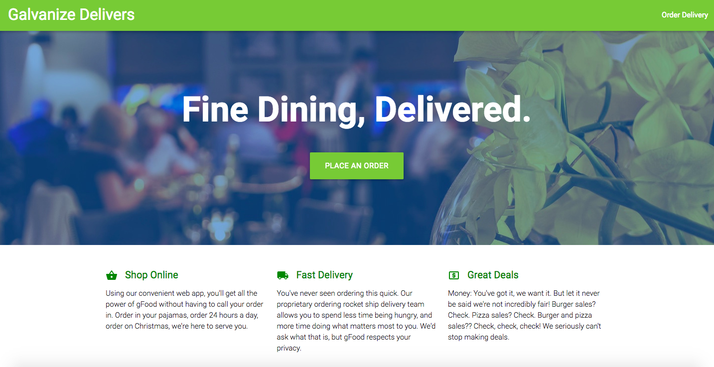
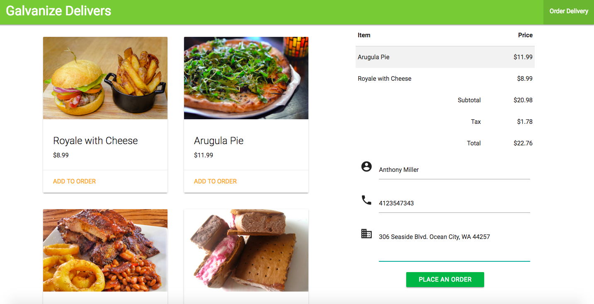
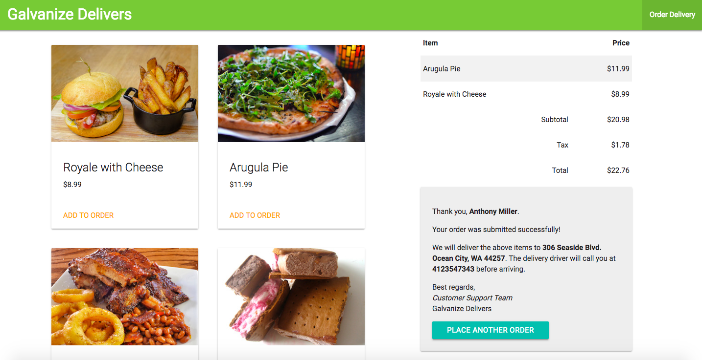

# React Galvanize Delivers

Created: Aug 2017 – Sep 2017

**Summary:**

Constructed a website for a fine dining delivery service with two pages — a landing page and an ordering page. The landing page contains the service's marketing copy and the ordering page allows the user to

- add menu items to the receipt which updates the subtotal, tax, and total.

- type their information into each required textfield of the delivery form.

- click the button to place the order.   

**Technologies:**

Frontend: JavaScript ES6, HTML, Materialize CSS, JSX, Storybook, React, Redux

Backend: HTTP

Testing: Jest, Enzyme   

## The Landing Page

   

## The Ordering Page

Desired menu items added to the order and customer info entered.

   

## Success Message

Order successfully placed!!

   
